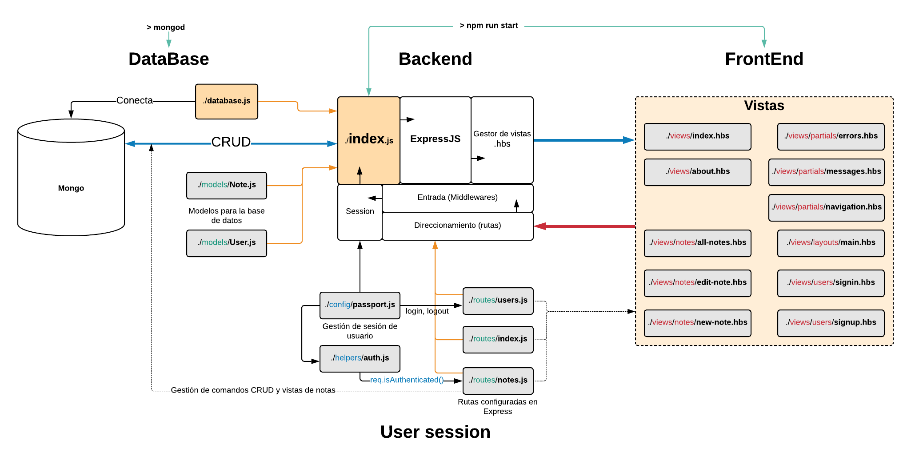

# Proyecto de APP de notas con autentificación y base de datos Mongo

## Referencias
[Vídeo tutorial](https://www.youtube.com/watch?v=-bI0diefasA)  
1. Backend: 04:47
2. Views (Template Engine): 41:24
3. CRUD: 59:13
4. Register/SingUp: 02:03:30
5. Login / SignIn: 02:30:27
6. Navigation: 02:51:54
7. Personal Data for Users: 03:12:40

## Avance del proyecto
Consultar archivo [CHANGELOG.md](CHANGELOG.md)

## Esquema de funcionamiento del proyecto

## TODO
- [ ] Averiguar el uso de express validator para las comprobaciones en formularios.
- [ ] Que las notas se añadan a Google-Docs
- [ ] leer sobre modulo bcryptjs y critpografía
- [ ] Leer otras formas de inicaiar sesión (google, etc..) con el módulo passport
- [ ] Mantener sesion con cookies