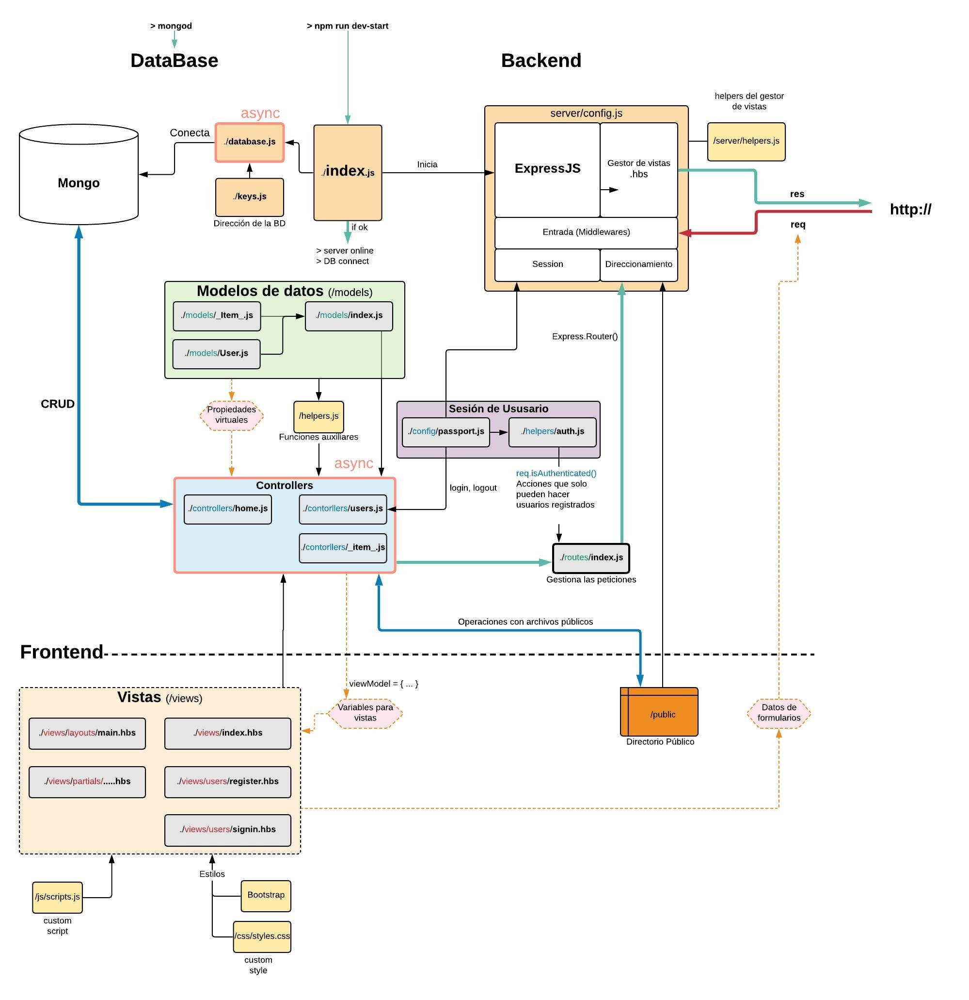

# Plantilla para proyecto ExpressJS-MongoDB.

Plantilla de servidor basada en el proyecto.

## Características
Plantilla para aplicación Node con servidor web Express y conexión a base de datos Mongo.
- CRUD de objeto -Item- a Mongo usando [mongoose](https://mongoosejs.com/).
- Mensajes a usuario con [connect-flash](https://github.com/jaredhanson/connect-flash)
- Subida de archivos al servidor con [multer](https://github.com/expressjs/multer)
- Configruado para logear errores [errorhandler](https://www.npmjs.com/package/errorhandler)
  - Configurar mensajes popups de errores [node-notifier](https://www.npmjs.com/package/node-notifier)

- Se añade sesión de usuario con 
  - [espress-passport](https://www.npmjs.com/package/express-passport)
  - [passport-local](https://www.npmjs.com/package/passport-local) Pligin para el esquema de mongo
  - [passport](https://www.npmjs.com/package/passport)
- Se añade aplicación de char entre usuarios con webshocket

## Instrucciones
La plantilla tiene un solo modelo llamado *\_Item_*.
En el código los elemementos de esta colección se denominan *\_item_* o *\_items_*. Varias funciones que se refieren a ellos también tienen estas palabras en su lugar.
Tiene la capacidad de subir archivos al directorio *public/upload* renombrados con el _id del item asociado
Para personalizar estos nombres usar *buscar y sustituir* del editor de código.

